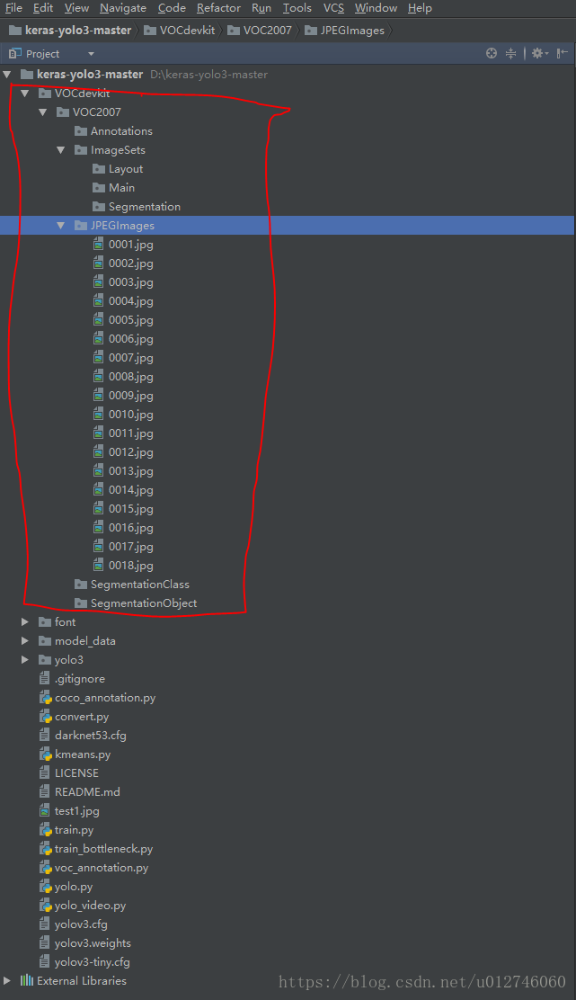
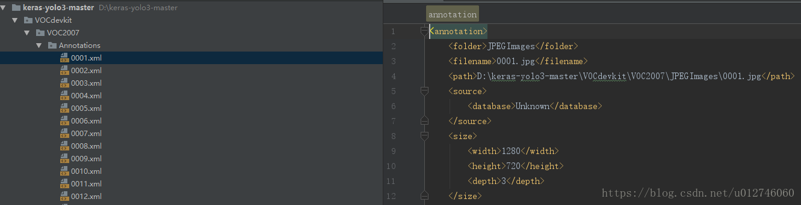
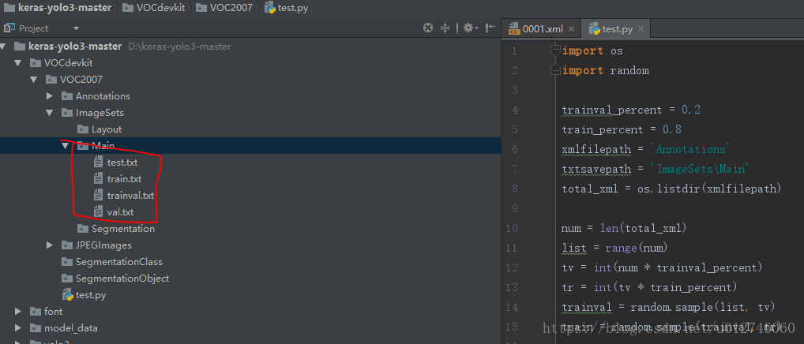
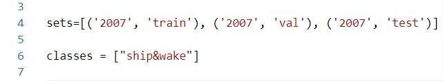
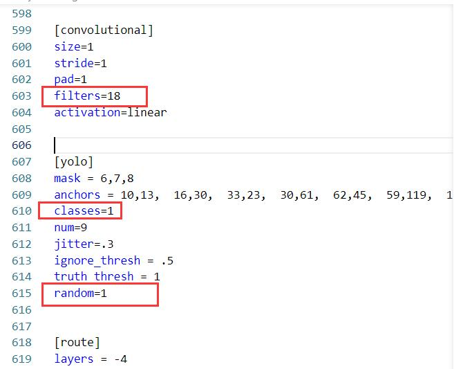
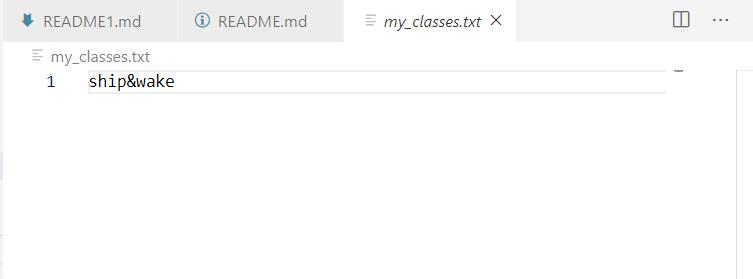

# 基于Yolo的舰船尾迹检测
### 1. 需要环境：<br>
·tensorflow = 1.14.0<br>
·keras = 2.1.5<br>
### 2. 训练
#### 2.1 数据集准备<br>
##### (PS:如果你已经准备好了数据集，且就是要检测舰船尾迹，直接跳到第(7)步)
(1) 在工程下新建一个文件夹VOCdevkit，目录结构为VOCdevkit/VOC2007/,在下面就是新建几个默认名字的文件夹 Annotation，ImageSet（该目录还有三个文件需要建立），JPEGImages(把你所有的图片都复制到该目录里面，如下图）。<br>

(2) 生成Annotation下的文件，安装工具labelImg，生成xml文件放入Annotation，注意，命名要与图片名字对应。<br>

(3) 生成ImageSet/Main/中的4个文件。在VOC2007下新建一个xml_convert.py文件，复制如下代码<br>
```Bash
import os
import random
 
trainval_percent = 0.2
train_percent = 0.8
xmlfilepath = 'Annotations'
txtsavepath = 'ImageSets\Main'
total_xml = os.listdir(xmlfilepath)
 
num = len(total_xml)
list = range(num)
tv = int(num * trainval_percent)
tr = int(tv * train_percent)
trainval = random.sample(list, tv)
train = random.sample(trainval, tr)
 
ftrainval = open('ImageSets/Main/trainval.txt', 'w')
ftest = open('ImageSets/Main/test.txt', 'w')
ftrain = open('ImageSets/Main/train.txt', 'w')
fval = open('ImageSets/Main/val.txt', 'w')
 
for i in list:
    name = total_xml[i][:-4] + '\n'
    if i in trainval:
        ftrainval.write(name)
        if i in train:
            ftest.write(name)
        else:
            fval.write(name)
    else:
        ftrain.write(name)
 
ftrainval.close()
ftrain.close()
fval.close()
ftest.close()
```
运行代码之后，生成如下文件，VOC2007数据集制作完成。<br>


(4) 生成yolo3所需的train.txt,val.txt,test.txt<br>
生成的数据集不能供yolov3直接使用。需要运行voc_annotation.py ，代码最开始的类别地方需要修改。<br>


(5) 修改参数文件yolo3.cfg
打开yolo3.cfg文件。搜索yolo(共出现三次)，每次按下图都要修改<br>
filter：3*(5+len(classes))
classes:你要训练的类别数（我这里是训练类）
random：原来是1，显存小改为0 


(6) 修改model_data下的my_classes.txt为自己训练的类别


(7) 对自己的数据集进行训练
```Bash
python train.py
```
对训练中的参数进行修改，直接更改配置文件train_set.json即可。

### 3. 测试
```Bash
python test.py
```
对训练中的参数进行修改，直接更改配置文件test_set.json即可。


